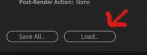

<h1 align='center'><b>Export to Stable Diffusion: a ScriptUI plugin for Adobe After Effects</b></h1>

<!-- An Adobe After Effects ScriptUI script for generating both image sequences and prompt files for Stable Diffusion, using the InvokeAI "dream.py" script. -->

<p align="center">
 
</p>

This After Effects script aims to turn Adobe After Effects into a versatile tool for creating image sequences and accompanying prompt batch files to be processed by [InvokeAI](https://github.com/invoke-ai/InvokeAI/blob/main/README.md)'s dream.py script. 

<br>


# **Table of Contents**

* [Why?](#why)
* [Installation](#installation)
* [How To Use](#how-to-use)
  * [Set Up Composition](#set-up-composition)
  * [Export Image Sequence and Prompt File](#export-image-sequence-and-prompt-file)
  * [Use the Prompt File in InvokeAI](#use-the-prompt-file-in-invokeai)
  * [Create Show-and-tell Composition](#create-show-and-tell-composition)
* [Key Features](#key-features)
* [Changelog](#latest-changes)
* [Contributing](#contributing)
* [Support](#support)
* [Thanks](#thanks)
* [TODO](#todo)

<br>

# **Why?**

Widespread access to quality text-to-image and image-to-image machine learning models is a new phenomenon, and it's difficult to predict what kinds of inputs we'll all be passing to the model in a year or two. Versatile tools serving as middleware to feed prompts and images to the machine learning models are great for exploration. 

After Effects is a compositing application that can export PNG sequences and also features a **very** extensive toolset for keyframing changes in values over time and/or scripting values in Javascript. This script is meant to add functions that help patch the output of After Effect's user-friendly tools into InvokeAI, which then feeds commands to Stable Diffusion. Ultimately the script is meant to aid in the use of InvokeAI for the exploration of the use of image and prompt batch sequences for animation or even single-image settings exploration. 

Here's an incomplete list of ideas to which this script might be of use:

- Tossing image sequences at the model just to see what comes back
- Using video to puppeteer AI-generated characters (e.g. President Lincoln above - inspired by [this example](https://old.reddit.com/r/StableDiffusion/comments/wyeoqq/turning_img2img_into_vid2vid/))
- Experimenting with one text prompt and a single still image as input, but keyframe a single variable to generate hundreds or thousands of variations while determining the best Image Strength, cfg_scale, or steps for generating a particular image
- Generate image sequences of animated solid shapes or text to send to the model
- Please experiment or speculate and add to this list.

<br>

# **Installation**

- Rather than download each of these files individually, either click the "Code" button on this page and choose "Download Zip", or clone the repository to a local drive using "git clone https://github.com/czyz/aftereffects_ESD" or a command-line git tool. 

<!-- <div style="float: right;margin-left:1em"> -->
<!-- no more divs, switching to old-school deprecated html to do these right-aligned images with text wrap. -->


- This script depends on specifically-named PNG Sequence output modules, which can be found in "additional_files/PNG sequence output modules.aom". To install these output modules:
<br clear=all>
  - Open After Effects's Output Modules window by clicking the menubar menu: Edit > Templates > Output Modules.<br> 
  - At the lower-left corner of that window is a 'Save All...' button, and next to that is a 'Load...' button. Click 'Load...'.<br>
  - Navigate to select the aforementioned output module file, and hit the 'Open' button.

<br>

- Install the scriptUI Panel and support files<br>
  - Copy "ESD Composition Setup.jsx" and the folder "Export_to_stable_diffusion" into:

    - On macOS:
    "/Applications/Adobe After Effects (version e.g. 2023)/Scripts/ScriptUI Panels"

    - On Windows: 
    "Program Files\Adobe\Adobe After Effects (version e.g. 2023)\Support Files\Scripts\ScriptUI Panels"
    
- Restart or launch After Effects
- In the menubar, click "Window > ESD Composition Setup.jsx" in order to launch the scriptUI panel. The first time it will launch as a window, but you can drag its gripper area and place the panel into the desired drop zone. 

<br>

# **How To Use**
<p align="center">
<br>
A simple composition with one prompt and an animated Image_Strength value.
</p>
<br clear=all>

<!-- <div style="float: right;margin-left:1em"> -->


<!-- footnote method borrowed from https://stackoverflow.com/a/32119820/20037038 -->
## Set up Composition
1. Create an After Effects composition that's of the size you'd like Stable Diffusion to generate. Your comp's dimensions (and ultimately your image sequence's dimensions) will serve the same function as the -W and -H arguments to the InvokeAI prompt. You may find that Stable Diffusion will run out of VRAM if the images you request from it are beyond some limit.  For reference, 448 x 768, 704 x 512, and 576 x 640 all work on a RTX 3080Ti in full-precision.

2. Get your video all set up the way you like it. It could be an phone video, a still photo, a black solid with an animated circle bouncing in front of it, etc. 

Note: If your image contains alpha (for example if you've used After Effects masking tools to remove portions of the image), be sure to check the "Has Alpha" checkbox before clicking "Sequence" in step 10. 

3. Click the panel's "+ML_Settings Layer" button to add a layer with controls for Image_Strength, cfg_scale, and steps. The controls are all sliders that can be found in the 'Effects' controls for that new layer. For the accepted ranges of these values, please see the InvokeAI documentation.

<br clear=all>

4. Click the panel's "+Prompt Layer" button as many times as you like to generate your prompt text layers. You can optionally enter your prompt text before pressing the button, as a streamlining measure, but you can always just edit the text later as you see fit. The prompt_strength value can be set (use values from 0 to 1) via the control in the Effects section of each prompt text layer.

Note: Prompts can call on [LoRA models](https://stable-diffusion-art.com/lora/). For example the prompt used to generate the ink and paint version of myself for the picture-in-picture in the walkthrough video was "withLora(Pencil_Sketch_by_vizsumit,0.6) person sketch".


## Export Image Sequence and Prompt File
7. After the timeline is just how you like it, click the panel's "Launch Export Dialog" button. Please note: You must have one ML_Settings layer and at least one prompt layer for export to work.

8. Choose the output location and how the image file locations should be represented in the prompt file (paths omitted, included, or replaced by user-specified text). 

9. Take a look at all the other Output options and set them as needed. More information on their effects can be found in InvokeAI's documentation.

10. In the Export section of the Output tab, hit the "Sequence" button. 

The script will then do the following: 

- It will create a directory at the output location, named after the Composition. 
- If such a directory already exists, it will skip over that directory and create a directory named after the composition with a digit at the end of the name. 
- Then it will step through every frame of the comp and will write to the text file a series of prompts, one for each frame, listing the input image and path, prompts, and other specified options, in the syntax expected by InvokeAI. 
- After that it will add the comp to the render queue, set it to output to that new output location folder, set it to use the appropriate PNG Sequence output module, and will start the render of the png image sequence.<sup id="a1">[1](#myfootnote1)</sup>

Now you have an image sequence and a prompt file. If you chose your prompt options well, the images in that prompt file will have paths that lead Stable Diffusion to the images in your image sequence. 

## Use the Prompt File in InvokeAI
11. Open up a cmd or powershell window (or Terminal on macOS) and switch into the InvokeAI directory. e.g.: 

```
cd invokeai
```

Then activate InvokeAI's python virtualenv as follows (with quotes):

```
".venv/Scripts/activate"
````

And now you can tell InvokeAI to process your prompt file.

```
invokeai --outdir "output_directory_location" --from_file "the_prompt_file_you_just_generated.txt"
```

I like to drag the intended output folder and the prompt file into the cmd prompt window rather than trying to type those full paths, to avoid typos and to properly escape special characters. Both Windows Explorer and macOS Terminal will automatically type the path to a file or folder when it is dragged into the window.

If you'd like to use a specific model, you can specify that in the command, like so:

````
invokeai --model model_name --outdir "output_directory_location" --from_file "the_prompt_file_you_just_generated.txt"
````

For example, here is one sample invocation:

```
invokeai --model dreamshaper_631BakedVae --outdir "C:\Users\me\Documents\stablediffusion_outputs\talking_head_long" --from_file "C:\Users\me\Documents\stablediffusion_jobs\send_to_InvokeAI_head alpha\send_to_InvokeAI_head alpha.txt"
```

Sit back and watch as image after image is generated. If your images have alpha and you checked the "Has Alpha" checkbox before step #10, then InvokeAI will have the model inpaint those regions.

Please note that for non-animated or test purposes, the "Current Frame" button can be substituted for the "Sequence" button in step #10 above, and it will generate a single image and a related single-line prompt text file.

## Create Show-and-tell Composition
Before the next step you may need to rename all of the images generated by step #10. <sup id="a2">[2](#myfootnote2)</sup> After that you can go ahead with the following:

12. Import into After Effects the image sequence that was created by Stable Diffusion as a result of step #10. 

13. Double-check that After Effects has assigned the imported image sequence the correct frame rate.<sup id="a3">[3](#myfootnote3)</sup>

14. Click to select the original composition, followed by the image sequence you imported in step #11. The order of selection is important.

15. In the panel, click the "Make Show and Tell Comp" button.

The Show and Tell composition has now been generated. You may want to also do the following:

16. Open up the show and tell composition and adjust the position and appearance of layers within it. 

17. The original composition's text prompts are visible but redundant in a Show and Tell composition. Open up the nested, original composition, and move its prompt text layers to the bottom of its stack, or change their opacity such that they are not visible over the image. Because the show and tell comp tests to see whether these prompts are active at the current time in order to determine whether to display them, they will unfortunately disappear from view completely if you hide their layer using the eyeball icon, so other methods such as moving them below a color solid layer or making them transparent are functional workarounds.

The Show and Tell Composition expressions have been written to expect the original comp to always be on the second layer from the bottom of the stack. This makes it very easy to reuse customized show and tell composition layouts. If you select the original comp within a show and tell comp and then hold down the option or alt key as you drag a different original comp over it, it will be replaced within the show and tell comp and the prompt text displays will update to show the text contents and strength values of the prompt text layers it contains. 

<br>

# **Key Features**

### Keyframeable Prompt Layers
Using this script one can set up a composition with any number of prompt layers, and with the ability to keyframe the prompt strengths for each layer. For example 3 prompt layers could be keyframed over time such that the generated unicorn progressively becomes less "coated in glitter" and more "burnt to ash":

```
a rainbow unicorn:0.33 coated in glitter:0.62 burnt to ash:0.05
a rainbow unicorn:0.33 coated in glitter:0.57 burnt to ash:0.10
a rainbow unicorn:0.33 coated in glitter:0.52 burnt to ash:0.15
...
a rainbow unicorn:0.33 burnt to ash:0.66
```

That's a nice simple-sounding example<sup id="a4">[4](#myfootnote4)</sup>, and one can easily imagine how to keyframe those weights over time. But if the results aren't quite right, one can then duplicate their comp and change the prompts and keyframing until the desired result has been achieved. 

<p align="center">

</p>

*a keen observer may note that the prompt weights on this frame don't add up to 100%. Normalization of prompt weights at each frame would be an easy thing to add –however this isn't immediately necessary as this feature already exists within InvokeAI. These weights **were** normalized, it just happened outside of After Effects.*
<p><br>


### Keyframeable Strength and Scale
The "Image_Strength", "cfg_scale", and "steps" sliders on the "ML_settings" layer can be used to keyframe these parameters over the course of an image sequence.

<br>

### Easy "Show and Tell" Composition creation
Select a Composition and an image sequence, hit the "Make show and tell comp" button, and a new composition will be created that places both of these elements side-by-side and features on-screen text showing the prompt text and the weight values of each of its phrases, as well as other settings. Still frames from a couple of these "Show and Tell" compositions can be seen in this document.

<br>

### Other features
- Generate or specify seed values
- Re-use recent seed values
- Control of ESRGan (Upscaling) factor and strength
- Control of GFPGan (Face Restoration) factor and strength
- Specify sampler
- Adjust how image paths are written within the prompt file
- Automatically saves user-specified settings and seed history
- Clear user-specified settings and seed history

<br>

# Latest Changes

- v2.00 (14 June 2023)
  - changed to function as scriptUI Panel. Updated for new InvokeAI features (additional samplers in menu). Clamped generated seed values to (2^32-1). Misc fixes.
- v1.00 (05 October 2022)
  - first release.

<br>

# Contributing

If you would like to contribute bug fixes, features, documentation, or do any other coding on this project, **please** do so. Please make any pull requests against the "development" branch so that cutting-edge changes can be tested on that branch and not the "main" branch. If you need information on how to contribute to GitHub projects, here's a [Getting Started Guide](https://opensource.com/article/19/7/create-pull-request-github).

<br>

# Support

For support,
please use this repository's GitHub Issues tracking service. 

<br>

If you make anything cool with this script. please send me a link, I'd love to see.

<br>

# Thanks
Special thanks to Lincoln D. Stein for making the InvokeAI script and making it easier for us muggles (speaking for myself) to manage to install and run local instances of Stable Diffusion on macOS, Windows, and Linux –and with an easy to use interactive prompt. Thanks to all the contributors of that project for adding features and making it hum. Thanks to Stability AI for taking an inevitable and possibly wildly-irresponsible step in unleashing an open-source machine-learning model of Stable Diffusion's quality on the world.

<br>

# ToDo

- Fast automated generation of "current frame" results, for quick and seamless iterating.
- Detect Composition resolutions that are incompatible with Stable Diffusion (i.e. don't have dimensions divisible by 48). Suggest compatible resolutions, possibly including suggestions based on available VRAM(?)
- Allow the user to specify the seed value as a slider Effect control within the "ML_Settings" layer, and use that if it exists (to allow users to use more than a single static seed value if desired)
- Submit pull request to InvokeAI for reordering image filenames so that the seed is at the beginning of the filename and the sequential numbers are at the end, so they function as image sequences in tools that expect standard frame numbers at the end of filenames.
- Submit pull request to InvokeAI for an option, similar to to the "prompt_as_dir" argument, to output images into a folder named after a prompt file's name, to aid in image sequence organization.


<br><br>
–––––––––––

<b id="myfootnote1">1</b> &nbsp; This function assumes there are no other active unrendered items in the render queue. This might not be a safe assumption and some tests and contingencies might need to be built into the logic.[↩](#a1)


<b id="myfootnote2">2</b> &nbsp; If InvokeAI appends the seed value to each image filename, as After Effects will only recognize that it is an image sequence if the image numbers at the end of the filename are consequential. One possible way to do this is via the renaming tool of your choice using a regular expression to turn filenames like these: 
  ```
  000001.1111111111.png
  000002.1111111111.png
  000003.1111111111.png
  ```
into these:
  ```
  000001.png
  000002.png
  000003.png
  ```
There are many ways to do a batch renaming, one possible way from a bash shell:
```
for i in $(ls *.png); do
  mv $i $(echo $i | sed -E 's/([^.]+)\.(.+)/\1.png/g'
  done
```
[↩](#a2) 

<b id="myfootnote3">3</b> &nbsp; If After Effects has assigned the image sequence the wrong frame rate:
- Right-click the image sequence in After Effects and choose "Interpret Footage > Main" from the popup contextual menu. 
- Change the value in the "Assume this frame rate" field to the correct frame rate.
- Hit the "OK" button.

If you'd like to change the default frame rate that After Effects assumes when it imports image sequences, you can change that setting in "Preferences > Import > Sequence Footage".[↩](#a3)

<b id="myfootnote4">4</b> &nbsp; Lines in the generated prompt file will be much longer than this example because they will include not only the prompts but also the path and filename of the images, the Image_strength value, scaling values, etc.[↩](#a4)